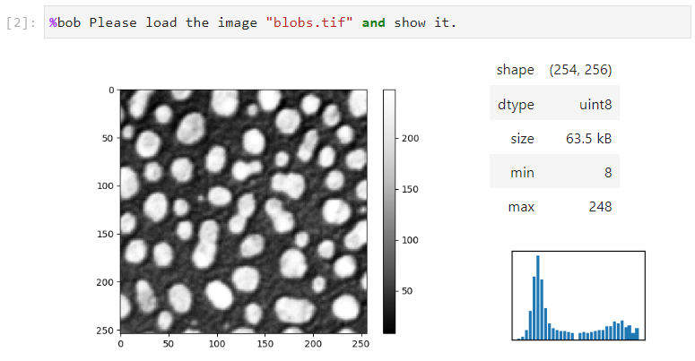
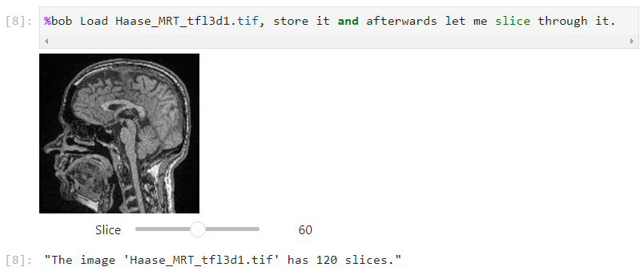
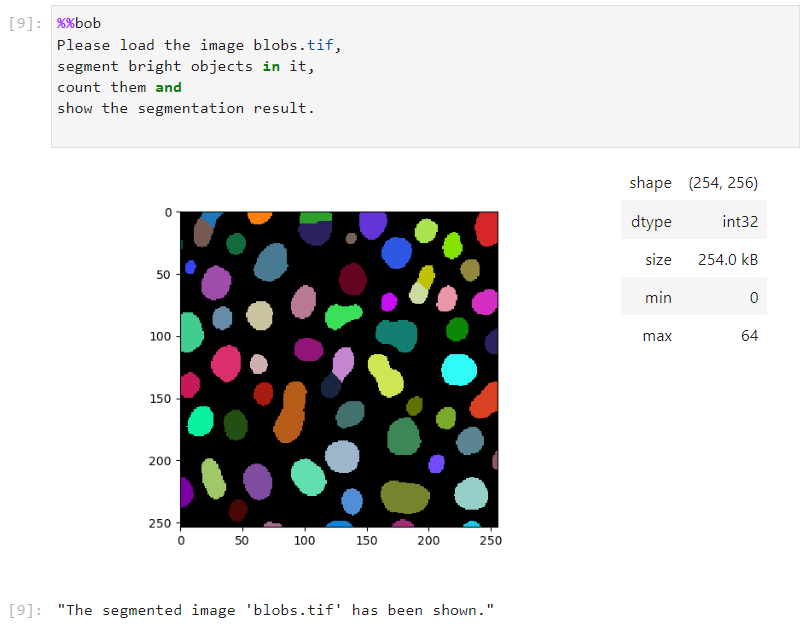
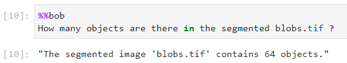

# bia-bob

BIA Bob is a Jupyter-based assistant for interacting with image data and for working on Bio-image Analysis tasks.
It is based on [LangChain](https://python.langchain.com/docs/get_started/introduction.html) and [OpenAI's API](https://openai.com/blog/openai-api). You need an openai API account to use it.

Note: Bob is currently in an early alpha stage. It is not very smart yet. Feedback is very welcome!

## Usage

Detailed examples of how to interact with Bob are given in [this notebook](https://github.com/haesleinhuepf/bia-bob/blob/main/demo/basic_demo.ipynb)

```
from bia_bob import bob
```









## Known issues

If you want to ask Bob a question, you need to put a space before the `?`.

```
What do you know about blobs.gif?
```

## Installation

```
pip install bia-bob
```


## Issues

If you encounter any problems or want to provide feedback or suggestions, please create a thread on [image.sc](https://image.sc) along with a detailed description and tag [@haesleinhuepf].


